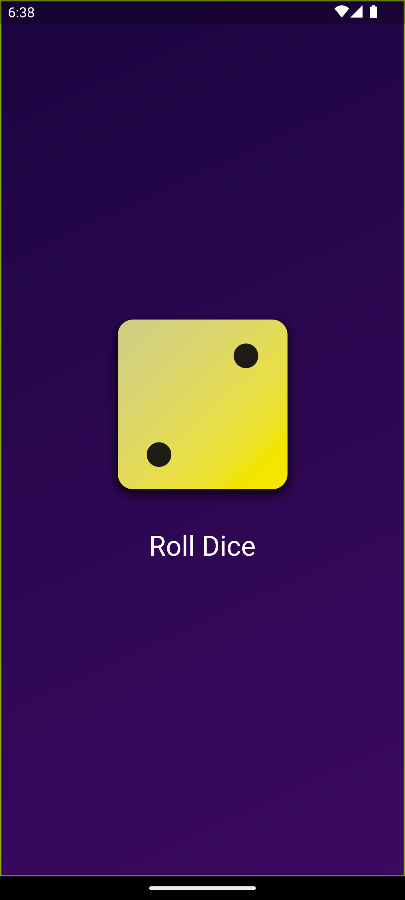

# Dice Roller App

Dice Roller is a simple, fun Flutter app that lets you roll a 6-sided dice. It's a perfect digital companion for board games, decision making, or just for fun! This code was produced during the completion of the Flutter course [A Complete Guide to the Flutter SDK & Flutter Framework for building native iOS and Android apps](https://www.udemy.com/course/learn-flutter-dart-to-build-ios-android-apps/learn/lecture/37130436#overview).

## Basic Functionality

  

    
- Elegant gradient background
- Tap a button to roll a dice
- Animated dice roll with actual images of a dice
- Displays the result with a nice animation

## Getting Started

To get a local copy up and running, follow these simple steps.

### Prerequisites

Make sure you have Flutter installed on your local machine. For help installing Flutter, see the [Flutter documentation](https://flutter.dev/docs/get-started/install).
